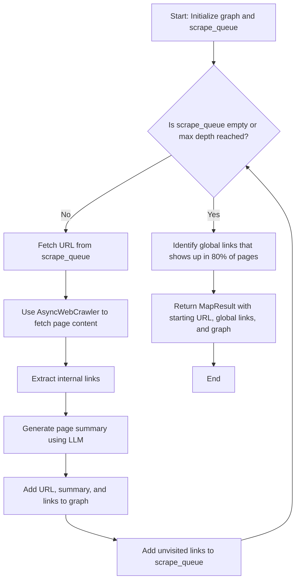

# User Flow Extraction API

## Overview

This submission is not quite 'good to go,' but it's getting there.

There is a lot of room for improvement in here but this is what I could bake with a weekend of brainstorming and two half-days of getting it to run.

I'll add in detail at the end how this API can be improved and how this aligns to the given problem statement.

---

## Service flow

---

## Tech Stack used

The project is built using the following technologies:

- **Python 3.13**: The core programming language.
- **FastAPI**: A modern, fast (high-performance) web framework for building APIs with Python.
- **Pydantic**: Used for data validation and settings management.
- **Crawl4AI**: A web crawling library with support for LLM-based content extraction.
- **Uvicorn**: An ASGI web server implementation for running the FastAPI application.
- **dotenv**: For managing environment variables.

---

## Future Improvements in Terms of Experience and Performance

1. **Process in background with an async endpoint**
   - Currently the crawling process is in sync with the client waiting for the result for a long time.
   - This can be fixed by introducing a polling pattern with an async endpoint that returns if the crawling has started.
   - Users can hence poll and check the progress.

1. **Parallel Crawling**:
   - Sequential crawling can be improved by multiprocessing using a pool of cores for it.

1. **Caching and Saving in DB**:
   - Implementing caching and saving it in a DB for previously visited URLs can reduce redundant requests and improve efficiency.
   - However, a time to live must be set such that we know when the DB/Cache entry is stale.

1. **Exponential Backoff retry**:
   - Add exponential backoff retry in the following scenarios:
     - Rate limiting on the target website
     - Rate limiting by LLMs

---

## Difference in Submission From the Given Problem Statement

The provided problem statement puts forward two distinct problems:

1. Global URL identification
2. User flow mapping

#### Global URL Identification

As far as the first problem, Global URL identification is concerned, my heuristic was just to list the URLs that was mentioned on 80% of the pages. However, I think [Z-Score](https://www.geeksforgeeks.org/machine-learning/z-score-for-outlier-detection-python/) can also be used to find the outliers if websites have many pages and global links are the outliers in it.

#### User flow mapping

Coming to our core problem of _User flow mapping_, our method uses an LLM to generate a summary or call-to-action for each page and use hyperlinks to create nodes. This restricts each page in the user flow graph to have just one action item or none.

However, I feel that the given problem statement is a non-trivial problem of implementing an Unsupervised User Flow Extraction where the crawler has to branch out depending on various scenarios available on the given page analysing not only the hyperlinks but the buttons, inputs and forms. This also means that there can be more than one node/action item per page.

I've considered (token based and basic) authentication and models for it has been created in `app/models/map.py`. They weren't used due to time constraint to experiment authentication.

---
